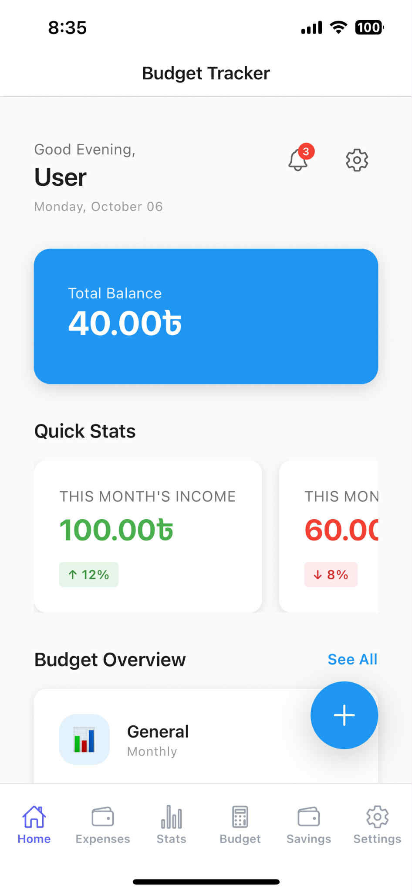
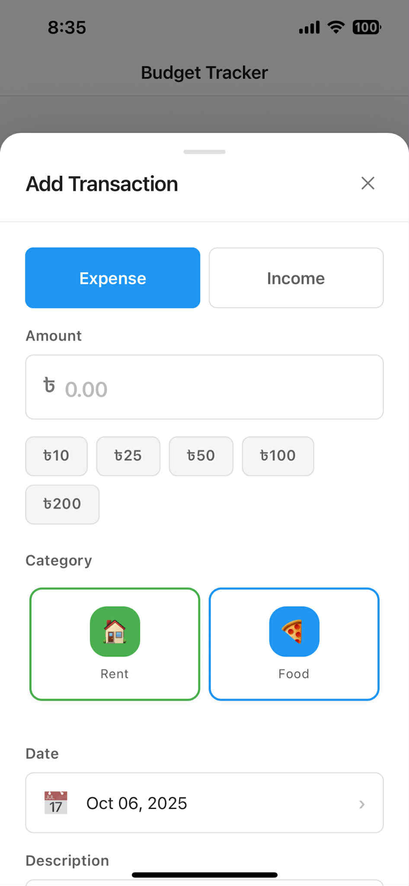
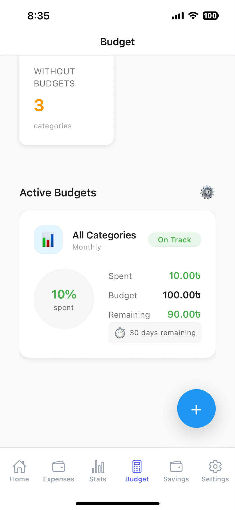

# Budget Tracker

A comprehensive React Native budget tracking application built with Expo, designed to help users manage their finances, track expenses, set budgets, and achieve savings goals.


## 📸 Screenshots





## ✨ Features

- 📊 **Dashboard** - Overview of your financial status at a glance
- 💰 **Transaction Management** - Track income and expenses with detailed categorization
- 🎯 **Budget Planning** - Set and monitor budgets for different categories
- 📈 **Statistics & Analytics** - Visualize spending patterns with charts and graphs
- 🏆 **Savings Goals** - Set and track progress towards financial goals
- 🔔 **Notifications** - Reminders and alerts for budget limits and goals
- 🔐 **Biometric Authentication** - Secure your financial data with local authentication
- 📱 **Offline-First** - Works seamlessly without internet connection
- 🌙 **Theme Support** - Customizable appearance settings
- 📊 **Data Visualization** - Interactive charts powered by Victory Native

## 🛠️ Tech Stack

- **Framework**: React Native with Expo
- **Language**: TypeScript
- **UI Library**: GlueStack UI
- **State Management**: Zustand
- **Database**: SQLite (expo-sqlite)
- **Navigation**: React Navigation (Stack & Bottom Tabs)
- **Data Fetching**: TanStack React Query
- **Form Handling**: React Hook Form
- **Animations**: Moti & React Native Reanimated
- **Charts**: Victory Native
- **Date Handling**: date-fns

## 📋 Prerequisites

Before you begin, ensure you have the following installed:

- **Node.js** (v18 or higher) - [Download](https://nodejs.org/)
- **npm** or **pnpm** - Comes with Node.js
- **Expo CLI** - Will be installed via npx
- **Git** - [Download](https://git-scm.com/)

### For Mobile Development

- **Android Studio** (for Android development) - [Download](https://developer.android.com/studio)
- **Xcode** (for iOS development, macOS only) - [Download](https://developer.apple.com/xcode/)

### For Testing

- **Expo Go** app on your mobile device:
  - [iOS App Store](https://apps.apple.com/app/expo-go/id982107779)
  - [Google Play Store](https://play.google.com/store/apps/details?id=host.exp.exponent)

## 🚀 Installation

### 1. Clone the Repository

```bash
git clone https://github.com/Soundreaver/BudgetTracker.git
cd budget-tracker
```

### 2. Install Dependencies

Using npm:
```bash
npm install
```

Or using pnpm:
```bash
pnpm install
```

### 3. Configure Environment Variables

Create a `.env` file in the root directory by copying the example file:

```bash
cp .env.example .env
```

Edit the `.env` file and add your configuration:

```env
# API Configuration (if using external APIs)
API_URL=https://api.example.com
API_KEY=your_api_key_here

# Environment
NODE_ENV=development
```

> **Note**: The app works offline-first with SQLite, so external API configuration is optional.

## 🏃 Running the App

### Start the Development Server

```bash
npm start
```

This will start the Expo development server and display a QR code.

### Run on Different Platforms

**Android:**
```bash
npm run android
```

**iOS (macOS only):**
```bash
npm run ios
```

**Web:**
```bash
npm run web
```

### Using Expo Go (Recommended for Quick Testing)

1. Install Expo Go on your mobile device
2. Run `npm start` on your computer
3. Scan the QR code with:
   - **iOS**: Camera app
   - **Android**: Expo Go app

## 📁 Project Structure

```
budget-tracker/
├── assets/                      # Images, fonts, and other static assets
│   ├── icon.png
│   ├── splash-icon.png
│   └── adaptive-icon.png
├── src/
│   ├── components/              # Reusable UI components
│   │   └── ui/                  # UI component library
│   │       ├── AmountInput.tsx
│   │       ├── BottomSheet.tsx
│   │       ├── BudgetProgressCard.tsx
│   │       ├── CategoryBadge.tsx
│   │       ├── CategoryPicker.tsx
│   │       ├── ChartCard.tsx
│   │       ├── CustomButton.tsx
│   │       ├── CustomCard.tsx
│   │       ├── CustomInput.tsx
│   │       ├── DateTimePicker.tsx
│   │       ├── EmptyState.tsx
│   │       ├── ProgressBar.tsx
│   │       ├── StatCard.tsx
│   │       ├── TransactionCard.tsx
│   │       └── index.ts
│   ├── config/                  # Configuration files
│   │   └── gluestack-ui.config.ts
│   ├── constants/               # App constants and theme
│   │   └── theme.ts
│   ├── hooks/                   # Custom React hooks
│   ├── navigation/              # Navigation configuration
│   ├── providers/               # Context providers
│   │   └── QueryProvider.tsx
│   ├── screens/                 # Screen components
│   │   ├── BudgetScreen.tsx
│   │   ├── DashboardScreen.tsx
│   │   ├── SavingsGoalsScreen.tsx
│   │   ├── SettingsScreen.tsx
│   │   ├── StatisticsScreen.tsx
│   │   ├── TransactionsScreen.tsx
│   │   └── index.ts
│   ├── services/                # Business logic and API services
│   │   ├── budgetService.ts
│   │   ├── categoryService.ts
│   │   ├── database.ts
│   │   ├── notificationService.ts
│   │   ├── savingsGoalService.ts
│   │   ├── transactionService.ts
│   │   └── index.ts
│   ├── store/                   # Zustand state management
│   │   ├── authStore.ts
│   │   ├── budgetStore.ts
│   │   ├── settingsStore.ts
│   │   ├── transactionStore.ts
│   │   └── index.ts
│   ├── types/                   # TypeScript type definitions
│   │   └── database.ts
│   └── utils/                   # Utility functions
│       ├── config.ts
│       ├── currency.ts
│       ├── debugUtils.ts
│       └── haptics.ts
├── screenshots/                 # App screenshots for documentation
├── .env.example                 # Environment variables template
├── .gitignore                   # Git ignore rules
├── app.json                     # Expo configuration
├── App.tsx                      # Main app component
├── babel.config.js              # Babel configuration
├── index.ts                     # App entry point
├── package.json                 # Dependencies and scripts
├── tsconfig.json                # TypeScript configuration
└── README.md                    # This file
```

## 🧪 Development

### Available Scripts

- `npm start` - Start the Expo development server
- `npm run android` - Run on Android emulator/device
- `npm run ios` - Run on iOS simulator/device
- `npm run web` - Run in web browser
- `npm run lint` - Run ESLint to check code quality
- `npm run lint:fix` - Auto-fix linting issues
- `npm run format` - Format code with Prettier

### Code Quality

The project uses:
- **ESLint** for code linting
- **Prettier** for code formatting
- **TypeScript** for type safety

Run linting before committing:
```bash
npm run lint
```

Auto-fix issues:
```bash
npm run lint:fix
```

Format code:
```bash
npm run format
```

## 🗄️ Database

The app uses **SQLite** for local data storage with the following main tables:
- Transactions
- Budgets
- Categories
- Savings Goals
- Settings

Data is stored locally on the device and persists across app restarts.

## 🔐 Security Features

- **Biometric Authentication**: Secure app access using fingerprint/face recognition
- **Local Storage**: All data stored locally using SQLite
- **No Cloud Dependency**: Your financial data stays on your device

## 📱 Features Breakdown

### Dashboard
- Quick overview of total balance
- Recent transactions
- Budget status
- Upcoming bills and goals

### Transactions
- Add/edit/delete transactions
- Categorize income and expenses
- Filter and search capabilities
- Detailed transaction history

### Budget Management
- Set monthly/weekly budgets per category
- Track spending against budgets
- Visual progress indicators
- Budget alerts and notifications

### Statistics
- Spending trends over time
- Category-wise breakdown
- Interactive charts and graphs
- Export capabilities

### Savings Goals
- Create multiple savings goals
- Track progress visually
- Set target amounts and deadlines
- Celebrate achievements

### Settings
- Theme customization
- Currency settings
- Notification preferences
- Security settings
- Data backup and restore

## 🤝 Contributing

Contributions are welcome! Please follow these steps:

1. Fork the repository
2. Create a feature branch (`git checkout -b feature/AmazingFeature`)
3. Commit your changes (`git commit -m 'Add some AmazingFeature'`)
4. Push to the branch (`git push origin feature/AmazingFeature`)
5. Open a Pull Request

### Commit Message Convention

Follow conventional commits:
- `feat:` - New feature
- `fix:` - Bug fix
- `docs:` - Documentation changes
- `style:` - Code style changes (formatting, etc.)
- `refactor:` - Code refactoring
- `test:` - Adding tests
- `chore:` - Maintenance tasks

## 🐛 Troubleshooting

### Common Issues

**1. Metro bundler not starting**
```bash
# Clear cache and restart
npx expo start -c
```

**2. Dependencies issues**
```bash
# Remove node_modules and reinstall
rm -rf node_modules
npm install
```

**3. Android build issues**
```bash
# Clean Android build
cd android
./gradlew clean
cd ..
npm run android
```

**4. iOS build issues (macOS)**
```bash
# Clean iOS build
cd ios
pod install
cd ..
npm run ios
```

## 📄 License

This project is licensed under the MIT License - see the [LICENSE](LICENSE) file for details.

## 👨‍💻 Author

**Soundreaver**
- GitHub: [@Soundreaver](https://github.com/Soundreaver)
- Repository: [BudgetTracker](https://github.com/Soundreaver/BudgetTracker)

## 🙏 Acknowledgments

- Built with [Expo](https://expo.dev/)
- UI components from [GlueStack UI](https://gluestack.io/)
- Charts powered by [Victory Native](https://commerce.nearform.com/open-source/victory-native/)
- Icons from [Expo Vector Icons](https://icons.expo.fyi/)

## 📮 Support

If you encounter any issues or have questions:
1. Check the [Issues](https://github.com/Soundreaver/BudgetTracker/issues) page
2. Create a new issue with detailed description
3. Include screenshots and error logs when applicable

---

**Happy Budget Tracking! 💰📊**
